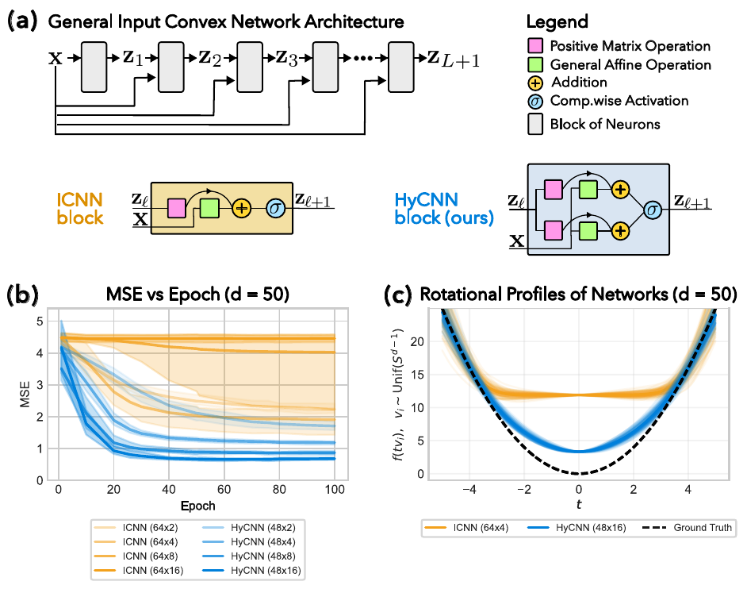

# Hyper Input Convex Neural Networks

This folder contains a curated, **publicly runnable** subset of the experimental code that accompanies our paper

> **Hyper Input Convex Neural Networks for Shape Constrained Learning and Optimal Transport.**

It is *not* a full reproduction of the paper’s contents and rather a **short, self-contained overview** of the three core
experimental pillars of the paper, packaged as three Jupyter notebooks that each run end-to-end on a laptop, a Google Colab GPU, or an Apple Silicon MPS device, with no project-internal imports.

If you want to understand what HyCNN is, what it does differently from a standard ICNN, and how it behaves on convex regression and on optimal-transport map estimation, this folder is the place to start.

<p align="center">
  
</p>

<p align="center">
  <em>(a) The shared input-convex backbone used by both ICNN and HyCNN, with
  the two block types compared side by side. The HyCNN block (ours) replaces
  the ICNN&rsquo;s ReLU activation with a smooth log-sum-exp (maxout) gate and
  augments the residual structure of the layer.
  (b) Test MSE versus epoch on a noisy <code>d&nbsp;=&nbsp;50</code> convex
  regression target: HyCNN (blue) converges substantially faster and to a
  lower loss than ICNN (orange) across widths and depths.
  (c) Rotational extrapolation profiles along random rays through the origin:
  HyCNN tracks the convex ground truth (dashed) accurately, while ICNN
  flattens out and fails to extrapolate.</em>
</p>


## Contents

```
Public/
  Regression.ipynb         # Convex regression in d = 50, ICNN-family vs HyCNN vs MLP
  OT_maps.ipynb            # 2D Brenier optimal-transport maps with HyCNN
  OT_maps_highdim.ipynb    # 50D Brenier OT with ICNN, ICNN-Leaky, ICNN-Quad, HyCNN
```

Each notebook is **completely standalone**: the network architectures, data samplers, training loops, schedulers, and plotting routines are inlined. Re-running a notebook will reproduce its figures end-to-end.


## The three notebooks

### 1. `Regression.ipynb` &mdash; Convex regression in `d = 50`

A drop-in benchmark of four architectures on a noisy convex regression target
in fifty dimensions.

* **Target.** `f(x) = sum_j x_j^2 = ||x||_2^2` on `x ~ Uniform([-1, 1]^50)`.
  Observations are `Y = f(X) + N(0, 1)`.
* **Models compared.** A non-convex MLP baseline at two depths, an Amos-style
  **ICNN**, a **GroupMaxNet**, and our **HyCNN**, each at multiple widths and
  depths with matched parameter budgets.
* **Training.** Empirical risk minimisation under squared loss with
  per-coordinate standardisation derived from the training set, exactly as in
  the reference simulation pipeline (`simulation.py::train_one_run`).
* **What it shows.**
  1. Test loss versus epoch on **noiseless** held-out samples, i.e. how fast
     each architecture finds the underlying convex function.
  2. Rotational extrapolation profiles along random rays through the origin,
     contrasting how the four families behave in regions only sparsely covered
     by the training distribution.

The notebook reproduces panels (b) and (c) of the figure above.


### 2. `OT_maps.ipynb` &mdash; 2D Brenier optimal-transport maps with HyCNN

A self-contained HyCNN implementation that learns the Brenier optimal-transport
map between four pairs of two-dimensional distributions by solving the
Makkuva-style **semi-dual minimax formulation** of the quadratic optimal
transport problem.

* **Configurations.** Four predefined runs that pair structured 2D distributions
  (checker-board variants, Gaussian mixtures, etc.) at controlled scale and
  variance.
* **Architecture.** A 48-wide, 4-deep HyCNN potential pair (forward and
  conjugate), trained with Adam at `beta = (0.5, 0.9)`, cosine learning-rate
  decay, and a cosine-with-warm-restarts schedule for the smoothness parameter
  `tau`.
* **Loss.** Semi-dual minimax with five inner steps per outer step, batch
  size 2000, 2500 outer iterations.
* **Evaluation.** Sinkhorn divergence (via `geomloss`, in float64 on the CPU
  for reproducibility across CUDA / MPS / CPU backends) computed every
  `plot_every` iterations.
* **Output.** Per-run forward and reverse transport visualisations, plus a
  combined four-panel sweep figure that mirrors the paper&rsquo;s 2D
  qualitative result.

Device handling is automatic: CUDA is preferred over MPS, and MPS over CPU.


### 3. `OT_maps_highdim.ipynb` &mdash; 50D Brenier optimal-transport maps

The high-dimensional companion to the 2D notebook. Five convex-potential
estimators are trained side by side on a closed-form transport problem in
`d = 50`.

* **Ground truth.** A strongly convex, anisotropic quadratic potential
  `psi(x) = (1/2) sum_i s_i x_i^2` with `s_i = 1 + 0.5 * sin(i)`. By
  Brenier&rsquo;s theorem, the optimal transport map from
  `mu = N(0, I_d)` to its pushforward
  `nu = (grad psi)_# mu` is exactly `T*(x) = grad psi(x) = (s_i x_i)_i`,
  so the task reduces to recovering the diagonal scaling `s` from samples.
* **Estimators.**
  * `ICNN` &mdash; standard Amos-style ICNN with strict softplus non-negativity.
  * `ICNNLeaky` &mdash; leaky-ReLU variant.
  * `ICNNQuad` &mdash; ICNN with a quadratic first hidden layer.
  * A *soft-penalty* ICNN variant using a `lambda_cvx` convexity penalty in
    place of hard softplus reparameterisation.
  * **HyCNN** &mdash; our log-sum-exp / maxout-gated input-convex network.
* **What it shows.** Prediction MSE of the learned transport map versus
  number of outer iterations, providing a direct head-to-head comparison of
  the four ICNN-family estimators against HyCNN in a controlled
  high-dimensional setting.


## Requirements

The notebooks rely only on the standard scientific Python stack plus
`geomloss`:

```bash
pip install numpy torch matplotlib geomloss
```

`geomloss` is auto-installed at notebook startup if missing (e.g. on a fresh
Colab runtime). No project-internal imports are needed.


## How to run

Each notebook is independent. From this folder:

```bash
jupyter notebook Regression.ipynb
jupyter notebook OT_maps.ipynb
jupyter notebook OT_maps_highdim.ipynb
```

Run all cells top to bottom. Default settings target a runtime of a few minutes
per notebook on a single GPU; on CPU expect tens of minutes for the OT
notebooks. All seeds are fixed, so results are reproducible.


## Citation

If you build on this work, please cite the paper:

```bibtex
@article{hundrieser2026hycnn,
  title   = {Hyper Input Convex Neural Networks for Shape Constrained Learning and Optimal Transport},
  author  = {Hundrieser, Shayan and Kong, Insung and Schmidt-Hieber, Johannes},
  journal = {Preprint},
  year    = {2026},
}
```
